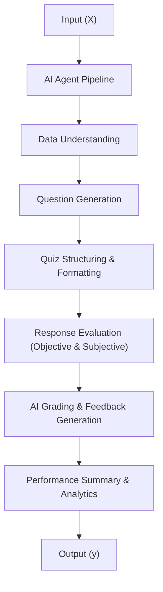

# 🎓 Online Quiz Maker AI Agent – Lab 1.4 Prompts

## Overview
This directory contains prompt examples for the **Automated Quiz Generation and Grading System** using Google Colab and Large Language Models (LLMs).  
The system allows educators to automatically generate quizzes, grade both objective and descriptive answers, and provide instant feedback.

🧩 System Architecture Concept
The AI agent is conceptualized as an **end-to-end solution**:

**Input (X):** Topic, syllabus, learning material, or student responses  
**Output (y):** Generated quiz, graded answers, feedback, and performance summary  

---
📂 Prompt Files
1️⃣ simple_zero_shot_prompt.md

Type: Zero-Shot Prompt
Purpose: Demonstrates how the AI agent generates and grades a single quiz instance without prior examples.
Use Case: Quick quiz creation for new topics when no previous examples exist.

Key Features:

Single input-based question and grading

Objective & subjective question generation

Automatic grading and feedback generation

Difficulty tagging (Easy, Medium, Hard)

2️⃣ few_shot_prompt.md

Type: Few-Shot Prompt
Purpose: Demonstrates quiz generation and grading after learning from multiple (X, y) examples.
Use Case: Improved performance and consistency when sample quizzes and grading patterns are available.

Key Features:

Uses prior (question → feedback) pairs

Learns grading consistency and style

Handles descriptive answers more accurately

Generates quizzes aligned with difficulty and topic

⚙️ How to Use These Prompts
🧪 For Developers / Educators:

Choose the prompt type:

Use simple_zero_shot_prompt.md for single-topic quiz generation.

Use few_shot_prompt.md when training examples are available for context.

Customize the input:

Replace topic or syllabus with your content.

Specify question type (objective/subjective/mixed).

Adjust grading scheme (marks, feedback style).

Run the AI agent in Google Colab:

from quiz_agent import generate_quiz, grade_answers
result = generate_quiz(topic="Python Basics", mode="few-shot")
display(result)

Evaluate the output:

Accuracy of generated questions

Fairness in grading

Relevance of feedback

📊 Evaluation Metrics

| Metric             | Description                              |  Target |
| :----------------- | :--------------------------------------- | :-----: |
| Question Relevance | Generated questions align with topic     |  ≥ 0.90 |
| Grading Accuracy   | AI-assigned score matches human judgment |  ≥ 0.95 |
| Feedback Quality   | Feedback is educational and fair         |  ≥ 0.90 |
| Difficulty Balance | Mix of Easy/Medium/Hard questions        | Optimal |
| Response Time      | Quiz generation latency in Colab         | ≤ 5 sec | 

---
**Question ID:** Q-001  
**Question:** What is the output of `print(2 ** 3)`?  
**Options:**  
- A) 5  
- B) 6  
- C) 8  
- D) 9  
**Correct Answer:** C  
**Difficulty:** Easy  
**Student Answer:** "8"  
**Score:** 1.0  
**Feedback:** Correct! You understood the concept of exponentiation.  
**Confidence Score:** 0.97  

🧩 Validation Checklist

Before finalizing results, ensure:

✅ All questions are relevant to the input topic
✅ Correct answers are verified through model reasoning
✅ Feedback is constructive and non-repetitive
✅ No bias or hallucination in grading
✅ Results are reproducible in Google Colab
✅ Data privacy (no external storage of student data

🧠 Key Technologies Used

Google Colab: Execution environment for Python-based quiz generation

Large Language Models (GPT, BERT): Question creation and grading

Natural Language Processing (NLP): Answer evaluation

JSON & CSV Handling: Quiz data structuring and storage

Matplotlib/Pandas: Result analytics and visualization

📈 Future Enhancements

Adaptive quizzes based on previous performance

Integration with Google Classroom / Moodle

Voice-based quiz generation

Real-time analytics dashboard
---

