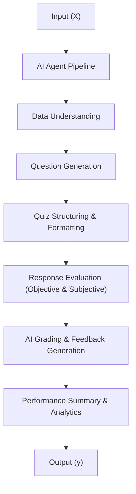

# 🎓 Automated Quiz Generation and Grading AI Agent

## 🧩 Overview
This directory contains **prompt examples** for the *Automated Quiz Generation and Grading System using Google Colab*.  
The system uses **Large Language Models (LLMs)** to automatically:
- Generate quizzes from course materials or topics  
- Grade student answers (objective + subjective)  
- Provide feedback and analytics  

The goal is to create a scalable, fair, and efficient quiz platform powered by **AI-driven evaluation**.

---

## ⚙️ System Architecture Concept

The AI agent functions as an end-to-end solution:

Input (X): Topic, syllabus, or student responses
Output (y): Generated quiz, grading, feedback, and performance summary

**📂 Prompt Files

1️⃣ simple_zero_shot_prompt.md**

**Type**: Zero-Shot Learning
**Purpose**: Demonstrates single-instance quiz generation and grading without prior examples.
**Use Case**: Generate a new quiz for a given topic with no existing data.

**Key Features:**

Generates multiple-choice and short-answer questions

Auto-grades and provides instant feedback

Works directly in Google Colab

Evaluates difficulty and confidence

**Example Domain:**
Intro to Python Programming

**2️⃣ few_shot_prompt.md**

**Type:** Few-Shot Learning
**Purpose:** Demonstrates quiz generation after learning from multiple (X,y) examples.
**Use Case:** Improved quiz quality and grading accuracy when example quizzes and answers are provided.
**
Key Features:**

Learns structure and tone from prior quizzes

Applies patterns from multiple examples (Math, Science, CS)

Maintains consistent formatting and fairness in grading

**Training Examples Included:**

Python Programming (Data Types, Loops)

Mathematics (Functions and Equations)

General Knowledge (History, Geography)

**New Task**: AI Basics (Machine Learning Concepts)

🧠 How to Use These Prompts
For Students or Educators

**Choose a prompt type:**

Use Zero-Shot for quick quiz creation

Use Few-Shot for improved consistency

**In Google Colab:**

Upload your topic or document (PDF, text, etc.)

Run the prompt with your LLM integration

**View:**

Generated quiz

Graded answers

AI-generated feedback and performance summary

🧩 Pseudocode Example
def generate_and_grade_quiz(topic, student_answers=None):
    # 1. Understand topic
    content = preprocess(topic)
    
    # 2. Generate quiz questions
    quiz = generate_questions(content)
    
    # 3. Structure and format
    formatted_quiz = structure_quiz(quiz)
    
    # 4. If answers provided, evaluate
    if student_answers:
        results = evaluate_answers(formatted_quiz, student_answers)
        feedback = generate_feedback(results)
        summary = performance_summary(results)
        return summary
    
    return formatted_quiz
**
🧾 Evaluation Metrics**
| Metric                 | Description                        | Target |
| :--------------------- | :--------------------------------- | :----: |
| Question Relevance     | Quiz matches given topic           | ≥ 0.90 |
| Grading Accuracy       | AI grades match correct answers    | ≥ 0.95 |
| Feedback Quality       | Feedback is meaningful and clear   | ≥ 0.90 |
| Confidence Reliability | Confidence aligns with correctness | ≥ 0.85 |
**
🧠 Domain-Specific Adaptations**

The prompts can be adapted for various domains by modifying:

**Subjects:**

Computer Science → Python, C, AI

Mathematics → Algebra, Probability

Science → Physics, Chemistry

Business → Marketing, Economics

Quiz Formats:

Objective (MCQs, True/False)

Subjective (Short/Long Answers)

Mixed

**Grading Modes:**

Rule-based scoring

LLM-based semantic evaluation

Hybrid (weighted scoring + reasoning)

**🧮 Expected Output Format**

All prompts generate structured results in this format:

Question ID: Q-001  
Question: What is the output of print(2 ** 3)?  
Options: [A] 5, [B] 6, [C] 8, [D] 9  
Correct Answer: [C]  
Difficulty: Easy  
Student Answer: "8"  
Score: 1.0  
Feedback: Correct! You understood the concept of exponentiation.  
Confidence Score: 0.97  

**✅ Validation Checklist**

Before considering the output final, ensure:

 Each question has a unique ID

 Questions align with topic or syllabus

 Difficulty level is appropriate

 Feedback is meaningful and fair

 Confidence score is consistent with correctness

 No hallucinated or irrelevant questions

**🧰 Key Technologies**

Google Colab for execution

Large Language Models (GPT/BERT family)

Python for pipeline automation

JSON / Pandas for structured output

Matplotlib for analytics and performance visualization

**🧾 Example Evaluation Summary**

| Student | Total Questions | Correct | Score (%) | Feedback Summary                          |
| :------ | :-------------- | :------ | :-------- | :---------------------------------------- |
| John    | 5               | 4       | 80%       | Strong understanding, minor syntax errors |
| Priya   | 5               | 5       | 100%      | Excellent performance                     |
| Amir    | 5               | 3       | 60%       | Needs more practice on operators          |

**🧠 Related Files**

simple_zero_shot_prompt.md
 – Example of generating a new quiz without prior data

few_shot_prompt.md
 – Example of generating improved quizzes after training on examples

**🧩 References**

Google Colab Documentation

OpenAI GPT Family Models

Python Official Documentation

Educational NLP Datasets for Quiz Generation

